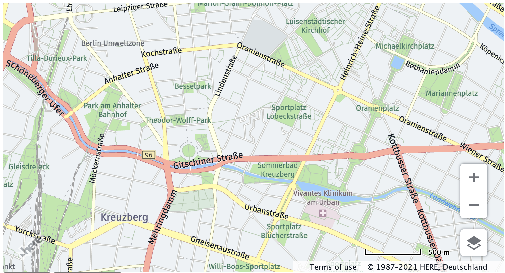
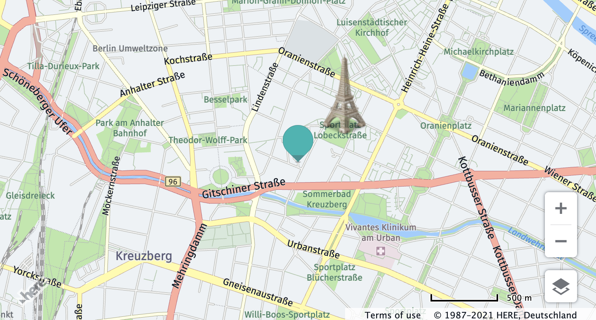

# `here-map` Web Component

Heavily inspired by [good-map](https://github.com/keanulee/good-map) but using HERE maps and adding markers.

`<here-map>` is a simple custom element wrapper for the [HERE Maps JavaScript API](https://developer.here.com/develop/javascript-api).

## Installation

Include [here-map.js](here-map.js) somewhere on your page (`async`/`defer` are optional):

```html
<script src="here-map.js" async defer></script>
```

## Usage

Create a `<here-map>` element anywhere on your page. Be sure to style the element with `display: block` and give it a height. You can also specify `zoom`, `latitude` and `longitude` attributes:

```html
<style>
here-map {
  display: block;
  height: 400px;
}
</style>

<here-map api-key="1234-54321"
    latitude="52.5"
    longitude="13.4"
    zoom="12"
></here-map>
```



Attributes on `<here-map>` are used for map initialization only and are not updated when the user interacts with the map although if the user updates the attributes, the underlying map is affected.

Clicking on the map will emit a `here-map-tap` event with the coordinates in the event detail.

For full interactive functionality, listen for the `here-map-ready` event and use  `event.detail` to access the underlying instance of [`H.map`](https://developer.here.com/documentation/maps/3.1.3.0/dev_guide/topics_api/h-map.html).

### Markers

You can also add markers to the map by using the `<here-map-marker>` element:

```html
<here-map
  api-key="1234-54321"
  latitude="52.5"
  longitude="13.4"
  zoom="12">

  <!-- Default marker-->
  <here-map-marker latitude="52.5" longitude="13.4" />

  <!-- Custom image -->
  <here-map-marker
    latitude="52.501"
    longitude="13.405"
    icon="https://cdn3.iconfinder.com/data/icons/tourism/eiffel200.png"
  />
</here-map>
```



If you omit the icon, the default HERE map icon will be used.

Clicking on a marker will cause the map element (NOTE: *not* the marker element) to emit a `here-marker-tap` event with the coordinates of the marker in the event detail.
